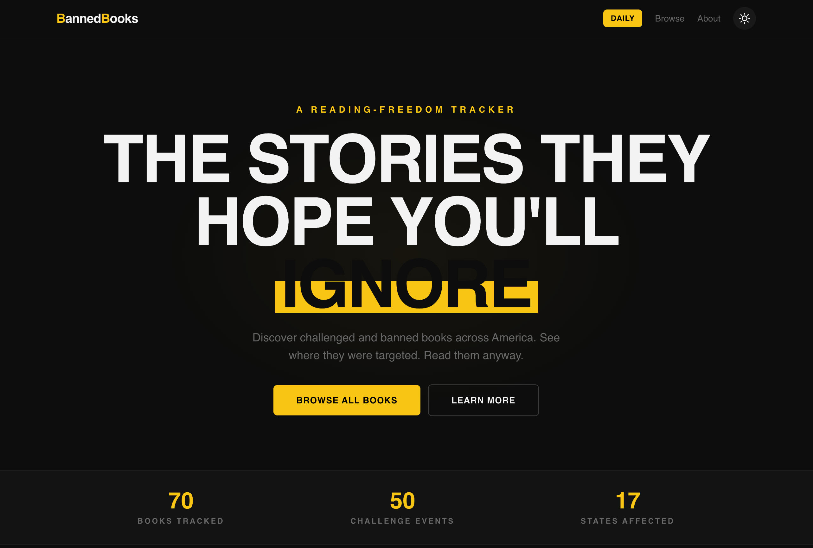

# BannedBooks.app

A reading-freedom tracker for challenged and banned books across America. Discover what's being removed from schools and libraries, see where it's happening, and find where to read those books anyway.



## What it does

- Browse challenged and banned books with full context on why they were targeted
- See which states, school districts, and institutions are involved
- Find links to buy, borrow, or read each book
- Play a daily game: guess the banned book from a redacted passage
- Filter by tags, themes, and challenge status

## Tech

- [Next.js 14](https://nextjs.org) (App Router)
- [Tailwind CSS v4](https://tailwindcss.com)
- TypeScript
- Deployed on [Netlify](https://netlify.com)

## Running locally

```bash
npm install
npm run dev
```

Open [http://localhost:3000](http://localhost:3000).

## Data

Book and challenge data lives in `/data`. Sources include PEN America, the American Library Association, and verified news reporting.

## Privacy

No data is collected from users — no analytics, no cookies, no tracking. See [bannedbooks.app/privacy](https://bannedbooks.app/privacy).
